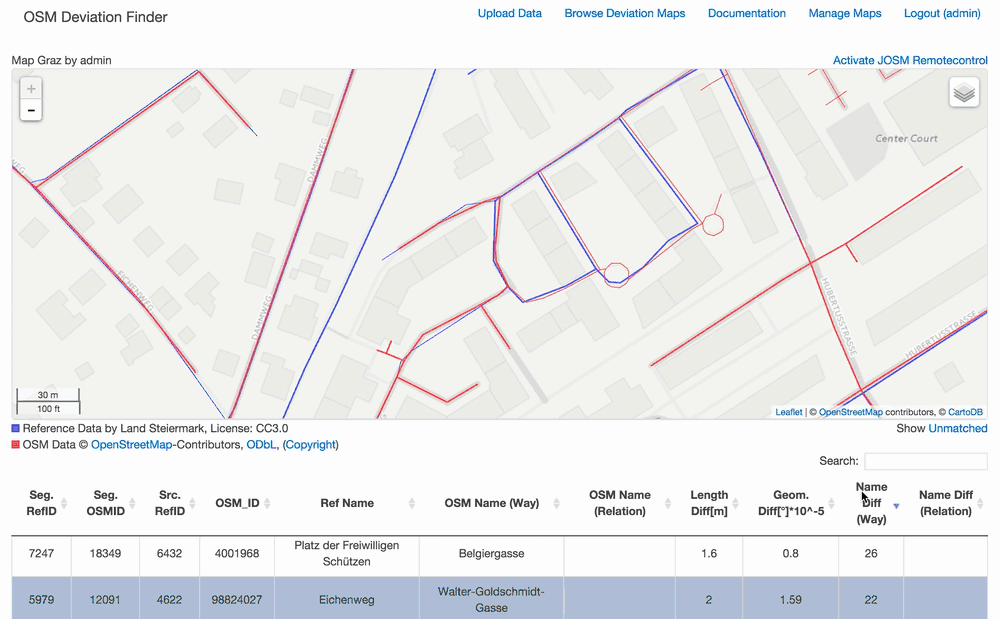

OSM Deviation Finder
==================================

A tool to find geometric and thematic deviations between reference road data
and the latest OpenStreetMap road data.

It's basically a library containing a collection of PostgreSQL/PostGIS queries and a web interface.
It can be used locally and is intended to be used as a webservice in future versions.
Currently it lacks some necessary security- and usermanagement features and
therefore it shouldn't be used as a webservice!

The follwing gif shows the web interface and how it is used to identify differences in street names of matched road segements from two different datasets.

The OSM Deviation Finder allows you to:
  - Import reference road data from shapefiles (in EPSG:4326) in to a PostgreSQL/PostGIS Database and automatically
    converts multigeometry features to new single features while keeping streetname and source feature id
  - Download the latest OSM road data for a given reference dataset using the OverpassAPI and allows you to choose
    which highway-types to exclude
  - Harmonize the datasets to minimize 1:m and m:n constraints between the datasets, which yields better linematching
    results. It also implements a simple cleaning function for non-intersecting or protruding line ends, which can be
    used to correct the line ends within a given threshold.
  - Linematch the features of the datasets by using four different and expressive matching parameters, which can be
    weighted
  - Genereate different line- and grid based results eg. positional deviation lines, extraction of matched- and
  nonmatched lines, linematching rate grid, max. positional deviation per cell grid, ...
  - View the genereated results on the web interface using a map (leaflet.js) and an interactive table (datatables.js)
  - Export the genereated results as WM(T)S using GeoServer and the GeoServer REST API
  - Exported results can then be imported into JOSM to visualise geometric and thematic deviations

Please keep in mind that the OSM Deviation Finder is not able to tell you if your data is correct!
It should only be used to find and visualize deviations between two datasets!

## Requirements
  - Python 2.7
  - Postgres 9.2.x (Extensions: PostGIS, fuzzystrmatch)
  - PostGIS 2.1.x
  - GDAL/OGR 1.10.x
  - GeoServer
  - Python-Packages (using virtualenv recommended):
    - Flask>=0.10
    - Jinja2>=2.4
    - itsdangerous>=0.21
    - Werkzeug>=0.9.6
    - MarkupSafe>=0.23
    - SQLAlchemy>=0.9.4
    - psycopg2>=2.5.3
    - Flask-Login>=0.2.11
    - Flask-SQLAlchemy>=1.0
    - Flask-Uploads>=0.1.3
    - gsconfig>=0.6.9
    - GDAL>=1.10.0

Tested on Apple OSX 10.9.5

## Vagrant Box
The easiest way to get it up and running:
Install [Vagrant](https://www.vagrantup.com "Vagrant") and [Virtualbox](https://www.virtualbox.org "Virtualbox") as Provider

1. Add the box (570MB):
`vagrant box add osmdeviationfinder_ubuntu http://dl.dropboxusercontent.com/s/8dc709laairnh2o/osmdeviationfinder_ubuntu.box`

2. Run the following command in a folder where you want to init the box:
`vagrant init osmdeviationfinder_ubuntu`

3. Create a forwarded port mapping by adding this line to the Vagrantfile:
`config.vm.network "forwarded_port", guest: 5000, host: 5000`

4. Start up the box:
`vagrant up`

5. Connect to the box:
`vagrant ssh`

6. To startup the osmdeviantionfinder web application run:
`./start_odf.sh`

This will set the virtualenvironemt for python and run the flask app.
You can use the app on your host machine by visiting [http://127.0.0.1:5000](http://127.0.0.1:5000) in your browser

## Thesis
The thesis (in german) is included in this repo and can be downloaded under the following link [thesis.pdf (40MB)](https://github.com/hochem/osmdeviationfinder/raw/master/thesis/thesis.pdf)

## Sample Data

Source: CC-BY-3.0-AT: Land Steiermark - [data.steiermark.gv.at](http://data.steiermark.gv.at/)